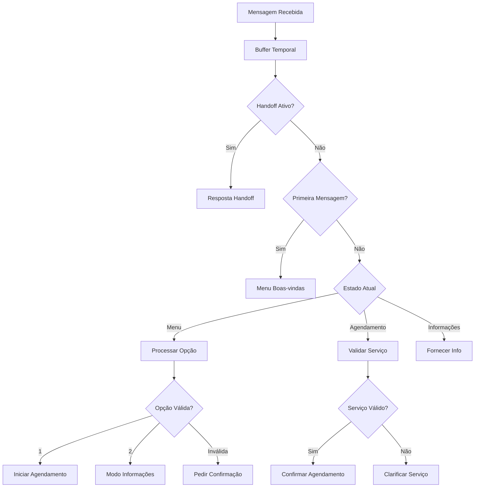

# Agente Syncbelle - Roteador WhatsApp

## Visão Geral

O **Agente Syncbelle** é um sistema de atendimento automatizado para WhatsApp Business API, projetado para eliminar falsos positivos de agendamento e fornecer um atendimento determinístico e confiável.

### Características Principais

- **Menu Determinístico**: Sempre oferece opções numeradas no primeiro turno
- **Buffer Temporal**: Agrupa mensagens quebradas em janela de 30 segundos
- **Validação Rigorosa**: Rejeita categorias genéricas antes de confirmar agendamentos
- **Handoff Humano**: Transferência imediata para atendimento humano quando necessário
- **Padrões NLP**: Reconhecimento inteligente de intenções com diferentes níveis de confiança

## Arquitetura

### Componentes Principais

1. **Syncbelle Router** (`src/agents/syncbelle-router.ts`)
   - Agente principal que coordena todo o fluxo
   - Gerencia estados de conversação
   - Integra todos os serviços

2. **Message Buffer** (`src/services/message-buffer.ts`)
   - Agrupa mensagens quebradas em 30s
   - Usa Redis com TTL automático
   - Chave: `buffer:{phone}`

3. **Human Handoff** (`src/services/human-handoff.ts`)
   - Flag global por telefone
   - Persistência em Redis + PostgreSQL
   - Endpoint admin para controle

4. **Validation Service** (`src/services/validation-service.ts`)
   - Valida disponibilidade antes de confirmar
   - Rejeita categorias/consultas ambíguas
   - Integra com Catalog + Trinks

5. **Response Templates** (`src/services/response-templates.ts`)
   - Templates personalizáveis com variáveis
   - Suporte a `{{user.first_name}}`, `{{top3.*.nome}}`
   - Respostas consistentes

6. **NLP Patterns** (`src/core/nlp-patterns.ts`)
   - Regex para detectar intenções
   - Classificação: explícita, categórica, ambígua, inválida
   - Stop words para encerramento

### Fluxo de Conversação



## Configuração

### Variáveis de Ambiente

```bash
# WhatsApp Business API
WHATSAPP_ACCESS_TOKEN=your_access_token
WHATSAPP_APP_SECRET=your_app_secret
WHATSAPP_VERIFY_TOKEN=your_verify_token
WHATSAPP_PHONE_NUMBER_ID=your_phone_number_id

# Marlie Agent
MARLIE_TEMPERATURE=0.2
MARLIE_MAX_TOKENS=400
MARLIE_BUFFER_WINDOW_SECONDS=30
MARLIE_SESSION_TIMEOUT_MINUTES=60

# Rate Limiting
RATE_LIMIT_WINDOW_MS=60000
RATE_LIMIT_MAX_REQUESTS=100
```

### Configuração do Webhook

1. **URL do Webhook**: `https://seu-dominio.com/api/whatsapp/webhook`
2. **Token de Verificação**: Use o valor de `WHATSAPP_VERIFY_TOKEN`
3. **Campos Subscritos**: `messages`

### Banco de Dados

Execute as migrações para criar as tabelas necessárias:

```sql
-- Tabela para handoff humano
CREATE TABLE IF NOT EXISTS human_handoffs (
    id SERIAL PRIMARY KEY,
    tenant_id VARCHAR(255) NOT NULL,
    phone VARCHAR(20) NOT NULL,
    enabled BOOLEAN NOT NULL DEFAULT false,
    reason TEXT,
    created_at TIMESTAMP DEFAULT CURRENT_TIMESTAMP,
    updated_at TIMESTAMP DEFAULT CURRENT_TIMESTAMP,
    expires_at TIMESTAMP,
    UNIQUE(tenant_id, phone)
);

CREATE INDEX idx_human_handoffs_tenant_phone ON human_handoffs(tenant_id, phone);
CREATE INDEX idx_human_handoffs_expires ON human_handoffs(expires_at);
```

## Uso

### Endpoints Principais

#### Webhook do WhatsApp
```http
GET /api/whatsapp/webhook
POST /api/whatsapp/webhook
```

#### Administração
```http
# Ativar/desativar handoff
POST /api/admin/handoff
{
  "phone": "+5511999999999",
  "enabled": true,
  "reason": "Cliente solicitou atendimento humano"
}

# Listar handoffs ativos
GET /api/admin/handoff

# Estatísticas
GET /api/whatsapp/stats

# Limpeza de dados expirados
POST /api/whatsapp/cleanup
```

### Exemplos de Conversação

#### Fluxo Normal - Agendamento
```
Usuário: Oi
Syncbelle: Olá, João! Sou a Syncbelle 🌸.
        Como posso ajudar hoje?
        1) Agendar atendimento
        2) Informações
        Responda com **1** ou **2**.

Usuário: 1
Syncbelle: Perfeito! Vou ajudar você a agendar um atendimento.
        Qual serviço você gostaria?

Usuário: Corte feminino
Syncbelle: Encontrei o serviço:
        ✅ Corte Feminino — 60min — R$ 80,00
        Confirma este serviço?

Usuário: Sim
Syncbelle: Ótimo! Agendamento confirmado.
        Em breve você receberá os detalhes.
```

#### Fluxo com Clarificação
```
Usuário: Quero fazer as unhas
Syncbelle: Antes de confirmar, preciso entender melhor o serviço.
        Você quis dizer algum destes? Responda com o número:
        1) Manicure — 45min — R$ 35,00
        2) Pedicure — 60min — R$ 40,00

Usuário: 1
Syncbelle: Perfeito! Manicure selecionada.
        Confirma este serviço?
```

#### Handoff Humano
```
Usuário: Preciso falar com alguém
Syncbelle: Entendi! Ativando atendimento humano.
        👩‍💼 Em breve um de nossos atendentes
        entrará em contato com você.

# Qualquer mensagem posterior:
Syncbelle: Atendimento humano ativo. 👩‍💼 Aguarde, por favor.
```

## Padrões NLP

### Detecção de Opções
```regex
# Opção 1 (Agendar)
^\s*1\s*$
(?i)\b(opção\s*1|um|1\.|número\s*1)\b
(?i)\bquero\s*(agendar|marcar)\b

# Opção 2 (Informações)
^\s*2\s*$
(?i)\b(opção\s*2|dois|2\.|número\s*2)\b
(?i)\b(quero|preciso)\s*(de )?informação(e?s)?\b
```

### Intenções de Agendamento
```regex
# Explícitas (alta confiança)
(?i)\b(quero\s*agendar|agendar\s*atendimento|marcar\s*agora)\b

# Ambíguas (pedem confirmação)
(?i)\bagenda(r)?\b
(?i)\bver\s*agenda\b
(?i)\bhorários?\b
```

### Stop Words
```regex
(?i)\bcancelar atendimento\b
(?i)\bencerrar\b
```

## Validação de Serviços

### Níveis de Confiança

1. **Explícita**: Serviço específico encontrado e disponível
2. **Categórica**: Categoria genérica (ex: "cabelo", "unhas")
3. **Ambígua**: Múltiplos serviços possíveis
4. **Inválida**: Não encontrado ou indisponível

### Comportamento por Nível

- **Explícita**: Confirma diretamente
- **Categórica/Ambígua**: Mostra top-3 opções para escolha
- **Inválida**: Pede nova especificação

## Monitoramento

### Métricas Importantes

- **Taxa de Conversão**: Menu → Agendamento confirmado
- **Falsos Positivos**: Agendamentos cancelados/não compareceram
- **Handoffs**: Frequência de transferência humana
- **Tempo de Resposta**: Latência do agente
- **Sessões Ativas**: Conversas em andamento

### Logs

```javascript
// Estrutura de log
{
  "timestamp": "2024-01-15T10:30:00Z",
  "level": "info",
  "phone": "+5511999999999",
  "action": "show_menu",
  "message": "Menu displayed to user",
  "metadata": {
    "sessionId": "sess_123",
    "tenantId": "tenant_1",
    "userInfo": { "first_name": "João" }
  }
}
```

## Testes

### Executar Testes

```bash
# Testes unitários
npm test

# Testes de integração
npm run test:integration

# Cobertura
npm run test:coverage
```

### Cenários de Teste

1. **Menu Determinístico**
   - Primeira mensagem sempre mostra menu
   - Opções 1/2 funcionam corretamente
   - Opções inválidas pedem confirmação

2. **Buffer Temporal**
   - Mensagens em <30s são agrupadas
   - Mensagens >30s são processadas separadamente

3. **Validação**
   - Serviços específicos são validados
   - Categorias genéricas são rejeitadas
   - Ambiguidades geram clarificação

4. **Handoff**
   - Ativação/desativação funciona
   - Mensagens são bloqueadas quando ativo
   - Limpeza automática de expirados

## Troubleshooting

### Problemas Comuns

#### Webhook não recebe mensagens
- Verifique URL e token de verificação
- Confirme assinatura do webhook
- Verifique logs de erro

#### Buffer não funciona
- Confirme conexão com Redis
- Verifique TTL das chaves
- Analise logs de buffer

#### Validação falha
- Verifique integração com Catalog Service
- Confirme dados de serviços no banco
- Teste conexão com Trinks

#### Handoff não ativa
- Verifique tabela `human_handoffs`
- Confirme tenant_id correto
- Analise logs de handoff

### Debug

```bash
# Ativar logs detalhados
LOG_LEVEL=debug npm start

# Verificar Redis
redis-cli monitor

# Verificar banco
psql -d marcleiaabade -c "SELECT * FROM human_handoffs;"

# Testar webhook
curl -X POST https://seu-dominio.com/api/whatsapp/webhook \
  -H "Content-Type: application/json" \
  -d '{"object":"whatsapp_business_account","entry":[]}'
```

## Roadmap

### Próximas Funcionalidades

- [ ] Integração com IA para respostas mais naturais
- [ ] Suporte a mídia (imagens, documentos)
- [ ] Analytics avançado com dashboard
- [ ] A/B testing de templates
- [ ] Integração com CRM
- [ ] Suporte multi-idioma
- [ ] Chatbot training interface

### Melhorias de Performance

- [ ] Cache de sessões em memória
- [ ] Otimização de queries do banco
- [ ] Compressão de payloads
- [ ] Load balancing
- [ ] Sharding de Redis

---

**Desenvolvido por**: SyncBelle Dev  
**Versão**: 1.0.0  
**Última atualização**: Janeiro 2024