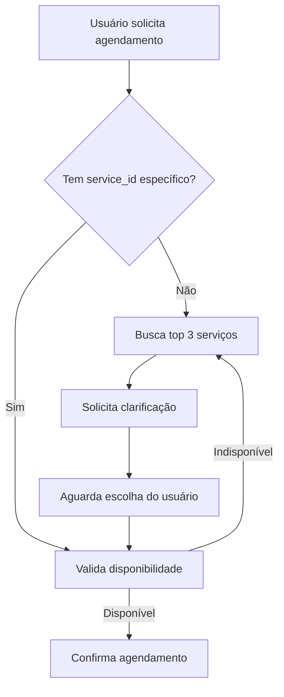

# Máquina de Estados - Marlie Bot

Este documento descreve a implementação da nova máquina de estados para o Marlie Bot, baseada na especificação YAML fornecida.

## Visão Geral

A máquina de estados implementa um fluxo conversacional determinístico que:

- ✅ **Menu determinístico** no primeiro turno com opções numeradas (1-Agendar, 2-Informações)
- ✅ **Buffer temporal** de 30s para agrupar mensagens quebradas
- ✅ **Padrões NLP** para detectar intenções e validar entradas
- ✅ **Handoff humano** com flag global por telefone
- ✅ **Validação rigorosa** antes de confirmar agendamentos
- ✅ **Templates personalizáveis** com variáveis dinâmicas
- ✅ **Configuração YAML** flexível e hot-reload

## Arquitetura

### Componentes Principais

```
src/core/
├── state-machine.ts              # Máquina de estados principal
├── state-machine-config.ts       # Carregador de configuração YAML
├── state-machine-config.yaml     # Configuração dos estados
├── conversation-controller.ts     # Controlador de conversas
├── state-machine-integration.ts  # Integração com sistema existente
└── nlp-patterns.ts               # Padrões de processamento de linguagem
```

### Estados Implementados

| Estado | Descrição | Transições |
|--------|-----------|------------|
| `START` | Estado inicial, verifica handoff humano | → `HUMAN_HANDOFF` ou `MENU_WAITING` |
| `HUMAN_HANDOFF` | Pausa completa enquanto HUMAN_OVERRIDE=true | → `HUMAN_HANDOFF` (permanece) |
| `MENU_WAITING` | Aguarda escolha 1/2, usa buffer de 30s | → `SCHEDULING_ROUTING`, `INFO_ROUTING`, `CONFIRM_INTENT` |
| `CONFIRM_INTENT` | Confirma intenção após trigger ambíguo | → `SCHEDULING_ROUTING`, `INFO_ROUTING` |
| `SCHEDULING_ROUTING` | Envia para subfluxo de agendamento | → `VALIDATE_BEFORE_CONFIRM` |
| `VALIDATE_BEFORE_CONFIRM` | Validação rigorosa antes de confirmar | → `SCHEDULING_CONFIRMED` ou permanece |
| `INFO_ROUTING` | Encaminha para subfluxo de informações | → `done` |
| `SCHEDULING_CONFIRMED` | Estado terminal de agendamento confirmado | Terminal |

## Configuração

### Variáveis de Ambiente

Copie `.env.state-machine.example` para `.env` e configure:

```bash
# Habilita a máquina de estados
ENABLE_STATE_MACHINE=true

# Fallback para roteador legado
FALLBACK_TO_LEGACY=true

# Debug detalhado
DEBUG_STATE_MACHINE=false

# Configuração Redis
REDIS_URL=redis://localhost:6379
REDIS_PREFIX=marlie

# TTLs
USER_CONTEXT_TTL=3600
BUFFER_TTL=30
```

### Configuração YAML

A configuração dos estados está em `src/core/state-machine-config.yaml`. Principais seções:

- **states**: Definição de cada estado e suas transições
- **routing**: Configuração de webhooks e roteamento
- **metrics**: Metas e contadores de métricas
- **acceptance_tests**: Testes de aceitação automatizados

## Uso

### Inicialização

```typescript
import { initializeStateMachineIntegration } from './src/core/state-machine-integration';

// Inicializa a integração
const integration = await initializeStateMachineIntegration({
  enableStateMachine: true,
  fallbackToLegacy: true,
  debugMode: false,
  redisPrefix: 'marlie'
});
```

### Processamento de Mensagens

```typescript
// Processa uma mensagem
const response = await integration.processMessage(
  '+5511999999999',  // telefone
  'Quero agendar',   // mensagem
  { source: 'whatsapp' }  // metadata opcional
);

console.log(response);
// {
//   text: "Ótimo! Para agendar, preciso entender melhor o serviço...",
//   currentState: "VALIDATE_BEFORE_CONFIRM",
//   nextActions: ["wait_user_input"]
// }
```

### Gerenciamento de Handoff

```typescript
// Ativa handoff humano
await integration.setHumanHandoff('+5511999999999', true);

// Desativa handoff humano
await integration.setHumanHandoff('+5511999999999', false);
```

## API Administrativa

### Endpoints Disponíveis

| Método | Endpoint | Descrição |
|--------|----------|----------|
| `POST` | `/admin/handoff/:phone` | Ativa/desativa handoff humano |
| `GET` | `/admin/conversation/:phone` | Obtém estado da conversa |
| `DELETE` | `/admin/conversation/:phone` | Reseta conversa |
| `GET` | `/admin/metrics` | Métricas da máquina de estados |
| `POST` | `/admin/cleanup` | Limpeza de dados expirados |
| `GET` | `/admin/config` | Configuração atual |
| `POST` | `/admin/test-message` | Testa processamento de mensagem |
| `GET` | `/admin/health` | Health check |

### Exemplo de Uso

```bash
# Ativa handoff humano
curl -X POST http://localhost:3000/admin/handoff/5511999999999 \
  -H "Authorization: Bearer $ADMIN_TOKEN" \
  -H "Content-Type: application/json" \
  -d '{"enabled": true, "reason": "Cliente solicitou atendimento humano"}'

# Obtém métricas
curl -X GET http://localhost:3000/admin/metrics \
  -H "Authorization: Bearer $ADMIN_TOKEN"
```

## Padrões NLP

### Padrões Implementados

- **option_1**: Detecta escolha da opção 1 (agendamento)
- **option_2**: Detecta escolha da opção 2 (informações)
- **explicit_schedule**: Detecta intenção explícita de agendamento
- **ambiguous_schedule**: Detecta intenção ambígua que precisa confirmação
- **stop_words**: Detecta palavras de parada

### Exemplos

```typescript
// Mensagens que ativam option_1
"1", "um", "primeira", "agendar", "marcar consulta"

// Mensagens que ativam option_2  
"2", "dois", "segunda", "informações", "horários"

// Mensagens ambíguas
"agenda", "horario", "consulta" (sem contexto claro)
```

## Templates de Resposta

### Templates Disponíveis

- `menu_welcome`: Menu inicial com opções 1 e 2
- `human_handoff_active`: Resposta durante handoff humano
- `confirm_intent`: Confirmação de intenção ambígua
- `invalid_option`: Opção inválida selecionada
- `clarify_service`: Clarificação de serviço
- `validation_failed`: Falha na validação
- `info_response`: Resposta de informações

### Variáveis Disponíveis

- `{{user.first_name}}`: Primeiro nome do usuário
- `{{user.phone}}`: Telefone do usuário
- `{{top3.*.nome}}`: Nome dos top 3 serviços
- `{{system.business_hours}}`: Horário de funcionamento
- `{{system.contact_info}}`: Informações de contato

## Buffer Temporal

O buffer temporal agrupa mensagens enviadas em sequência rápida:

```
Usuário envia:
00:00 - "quero"
00:05 - "agendar"
00:12 - "amanhã"

Sistema processa:
00:30 - "quero agendar amanhã" (mensagem consolidada)
```

### Configuração

- **TTL**: 30 segundos (configurável via `BUFFER_TTL`)
- **Chave Redis**: `{prefix}:buffer:{phone}`
- **Trigger**: Qualquer nova mensagem reinicia o timer

## Validação de Agendamentos

Antes de confirmar qualquer agendamento, o sistema:

1. **Verifica se há service_id específico** (não apenas categoria)
2. **Valida disponibilidade** via API Trinks
3. **Rejeita categorias vagas** ("cabelo", "estética")
4. **Oferece clarificação** com top 3 serviços

### Fluxo de Validação



## Métricas e Monitoramento

### Métricas Coletadas

- `activeConversations`: Conversas ativas
- `humanHandoffs`: Handoffs humanos ativos
- `activeBuffers`: Buffers temporais ativos
- `ambiguous_triggers_caught`: Triggers ambíguos detectados
- `validation_blocks`: Bloqueios por validação

### Metas de Qualidade

- **no_false_agenda_panes**: 0 panes com 'agenda' fora do menu em 200 conversas
- **single_block_after_buffer**: Mensagens quebradas resultam em interpretação única

## Testes de Aceitação

### Testes Implementados

1. **ambiguous_agenda_requires_confirmation**
   - Input: "agenda", "quero ver agenda", "horarios"
   - Esperado: Transição para `CONFIRM_INTENT`

2. **buffer_concatenation**
   - Input: Mensagens quebradas em sequência
   - Esperado: Concatenação e interpretação única

3. **validation_prevents_category_confirmation**
   - Input: Categoria sem service_id específico
   - Esperado: Bloqueio e solicitação de clarificação

## Troubleshooting

### Problemas Comuns

#### 1. Máquina de estados não responde

```bash
# Verifica se está habilitada
echo $ENABLE_STATE_MACHINE

# Verifica logs
tail -f logs/app.log | grep "state-machine"

# Testa health check
curl http://localhost:3000/admin/health
```

#### 2. Redis não conecta

```bash
# Verifica conexão Redis
redis-cli ping

# Verifica configuração
echo $REDIS_URL
```

#### 3. Configuração YAML inválida

```bash
# Valida YAML
yamlint src/core/state-machine-config.yaml

# Verifica logs de inicialização
grep "config" logs/app.log
```

### Logs Úteis

```bash
# Logs da máquina de estados
grep "StateMachine" logs/app.log

# Logs de transições
grep "transition" logs/app.log

# Logs de validação
grep "validation" logs/app.log
```

## Migração do Sistema Legado

### Estratégia de Migração

1. **Fase 1**: Deploy com `ENABLE_STATE_MACHINE=false`
2. **Fase 2**: Testes em ambiente de staging
3. **Fase 3**: Ativação gradual com `FALLBACK_TO_LEGACY=true`
4. **Fase 4**: Migração completa com monitoramento

### Rollback

Em caso de problemas:

```bash
# Desativa máquina de estados
export ENABLE_STATE_MACHINE=false

# Ou força fallback
export FALLBACK_TO_LEGACY=true

# Reinicia aplicação
pm2 restart marlie-bot
```

## Desenvolvimento

### Adicionando Novos Estados

1. **Edite** `src/core/state-machine-config.yaml`
2. **Adicione** lógica em `src/core/state-machine.ts` se necessário
3. **Crie** templates de resposta em `src/services/response-templates.ts`
4. **Teste** com `/admin/test-message`

### Adicionando Novos Padrões NLP

1. **Edite** `src/core/nlp-patterns.ts`
2. **Adicione** regex patterns
3. **Teste** com diferentes inputs
4. **Atualize** testes de aceitação

### Hot Reload

Com `HOT_RELOAD_CONFIG=true`, a configuração YAML é recarregada automaticamente.

## Contribuição

Para contribuir com melhorias:

1. **Fork** o repositório
2. **Crie** branch para feature
3. **Implemente** mudanças
4. **Teste** com testes de aceitação
5. **Submeta** pull request

---

**Documentação atualizada em**: Janeiro 2025  
**Versão da máquina de estados**: 1.0.0